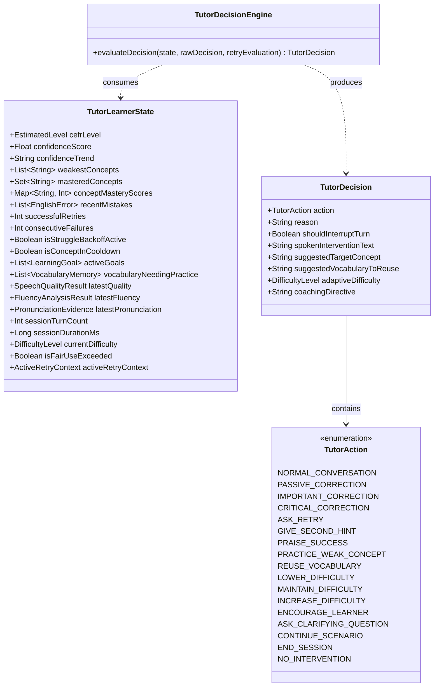

# VaniFlow — P3 Adaptive AI Tutor Brain Architecture

## 1. Core Design & Pedagogy

The **Adaptive AI Tutor Brain (`TutorDecisionEngine`)** is the central brain of VaniFlow. Its function is to answer the question:
> **"What should VaniFlow do next for this learner in this exact moment?"**

The LLM is an authentic conversation partner that produces natural conversational dialogue, but **never makes pedagogical decisions independently**. All pedagogical decisions (when to correct, when to ask for a retry, when to praise, when to steer towards weak concepts, when to adjust difficulty, when to back off) are made **deterministically** by `TutorDecisionEngine`.

---

## 2. Component Models

---

## 3. Deterministic Decision Priority Hierarchy

When evaluating a user turn, `TutorDecisionEngine` evaluates conditions in strict priority order:

1. **System & Safety Constraints**:
   - Session duration limit reached $\rightarrow$ `END_SESSION`
2. **Active Retry Evaluation**:
   - If user is currently in a retry loop:
     - `retryEvaluation.isFixed == true` $\rightarrow$ `PRAISE_SUCCESS`
     - `attemptsCount < 2` $\rightarrow$ `GIVE_SECOND_HINT`
     - Max attempts reached $\rightarrow$ `NORMAL_CONVERSATION` (acknowledge & release retry lock)
3. **Critical Correction**:
   - `severity == CRITICAL` $\rightarrow$ `CRITICAL_CORRECTION` / `ASK_RETRY` (Immediate spoken correction)
4. **Important Correction & Retry**:
   - `severity >= IMPORTANT && shouldDeliverSpokenCorrection == true` $\rightarrow$ `IMPORTANT_CORRECTION` / `ASK_RETRY`
5. **Struggle & Cognitive Load Protection**:
   - If `consecutiveFailures >= 3` or `confidence < 40` $\rightarrow$ `ENCOURAGE_LEARNER` / `LOWER_DIFFICULTY` (suppress non-critical interruptions, keep conversation supportive)
6. **Passive / Contextual Correction**:
   - If error detected but spoken interruption is suppressed by policy $\rightarrow$ `PASSIVE_CORRECTION` (attach correction to turn UI, model correct phrasing subtly in prompt)
7. **Session Learning Goal Pursuit**:
   - If an active goal has not been practiced in the session and scenario matches $\rightarrow$ `CONTINUE_SCENARIO` with goal-focused prompt directive
8. **Weak Concept Practice Steering**:
   - If a concept has low mastery ($<60$) and priority $\ge 60$ $\rightarrow$ `PRACTICE_WEAK_CONCEPT` (inject prompt directive for natural question eliciting the weak concept)
9. **Vocabulary Recycling**:
   - If vocabulary memory has expressions with familiarity $<50$ $\rightarrow$ `REUSE_VOCABULARY` (inject prompt directive to model or elicit expression)
10. **Adaptive Difficulty Escalation**:
    - If confidence $\ge 85$, retry success rate $\ge 80\%$, turn count $\ge 15$ $\rightarrow$ `INCREASE_DIFFICULTY`
11. **Natural Conversational Flow**:
    - Default $\rightarrow$ `NORMAL_CONVERSATION` / `MAINTAIN_DIFFICULTY`
